# LTO TrustChain: System Architecture Documentation

## Executive Summary

LTO TrustChain is a blockchain-based vehicle registration system designed for the Land Transportation Office of Lipa City. It integrates **Hyperledger Fabric** (a permissioned blockchain) with a modern web stack to provide **immutable record-keeping**, **smart contract automation**, and **transparent audit trails** for vehicle registrations and ownership transfers.

---

## 1. System Architecture Overview


---

## 2. Frontend Architecture

### 2.1 Technology Stack

| Component | Technology | Purpose |
|-----------|------------|---------|
| **Structure** | HTML5 | Semantic page layout |
| **Styling** | CSS3 + Custom CSS | Responsive design, dark theme |
| **Logic** | Vanilla JavaScript | Client-side interactivity, API calls |
| **Icons** | Font Awesome | UI iconography |
| **Fonts** | Google Fonts (Inter) | Typography |

### 2.2 Key Pages & Modules

| Page | File | Role-Based Access | Description |
|------|------|-------------------|-------------|
| **Landing** | `index.html` | Public | System introduction, public verification |
| **Login/Signup** | `login-signup.html` | Public | Authentication with 2FA support |
| **Registration Wizard** | `registration-wizard.html` | Vehicle Owner | Multi-step vehicle registration form |
| **Owner Dashboard** | `owner-dashboard.html` | Vehicle Owner | View vehicles, track registration status |
| **Transfer Ownership** | `transfer-ownership.html` | Vehicle Owner | Initiate ownership transfer |
| **Admin Dashboard** | `admin-dashboard.html` | LTO Admin | Manage registrations, approvals |
| **HPG Dashboard** | `hpg-admin-dashboard.html` | HPG Officer | Verify vehicle clearances |
| **Insurance Dashboard** | `insurance-verifier-dashboard.html` | Insurance Verifier | Verify insurance documents |
| **Public Verification** | `verify.html` | Public | Verify digital OR/CR certificates |

### 2.3 JavaScript Module Architecture

```
js/
├── api-client.js          # Centralized API communication
├── auth-manager.js        # Token management, session handling
├── registration-wizard.js # Multi-step registration logic
├── owner-dashboard.js     # Vehicle listing, status tracking
├── admin-dashboard.js     # Admin approval workflows
├── hpg-admin.js           # HPG verification logic
├── insurance-verifier-dashboard.js
├── document-modal.js      # Document viewing/management
├── toast-notification.js  # User feedback notifications
└── utils.js               # Shared utility functions
```

### 2.4 Frontend-Backend Communication

All API calls use the `api-client.js` module which:
- Attaches JWT tokens from `localStorage` to requests
- Handles token refresh automatically
- Provides standardized error handling
- Supports file uploads via `FormData`

```javascript
// Example: Fetching vehicles
const response = await apiClient.get('/api/vehicles?status=SUBMITTED');
```

---

## 3. Backend Architecture

### 3.1 Technology Stack

| Component | Technology | Purpose |
|-----------|------------|---------|
| **Runtime** | Node.js | Server-side JavaScript execution |
| **Framework** | Express.js | REST API routing, middleware |
| **Database** | PostgreSQL | Relational data storage |
| **Blockchain** | Hyperledger Fabric 2.5 | Immutable ledger, smart contracts |
| **Authentication** | JWT + bcrypt | Secure token-based auth |
| **Security** | Helmet, CORS, Rate Limiting | API protection |

### 3.2 Server Entry Point (`server.js`)

The main server file configures:

1. **Security Middleware**: Helmet CSP, CORS, rate limiting
2. **Body Parsing**: JSON and URL-encoded payloads (50MB limit for documents)
3. **Static File Serving**: HTML pages, uploads directory
4. **API Route Mounting**: All `/api/*` endpoints
5. **Database Validation**: Schema checks on startup
6. **Scheduled Tasks**: Expiry notifications, sync jobs

### 3.3 API Routes Structure

```
backend/routes/
├── auth.js              # Login, signup, 2FA, password reset
├── vehicles.js          # Vehicle CRUD, registration workflow
├── transfer.js          # Ownership transfer workflow
├── documents.js         # Document upload/retrieval
├── certificates.js      # Digital OR/CR generation
├── blockchain.js        # Direct Fabric ledger queries
├── integrity.js         # DB-Blockchain cross-verification
├── hpg.js               # HPG clearance endpoints
├── insurance.js         # Insurance verification endpoints
├── admin.js             # Admin management functions
└── health.js            # System health checks
```

### 3.4 Services Layer

Business logic is encapsulated in services:

| Service | File | Responsibility |
|---------|------|----------------|
| **Fabric Service** | `optimizedFabricService.js` | All blockchain interactions |
| **Integrity Service** | `integrityService.js` | DB-Chain comparison |
| **Certificate Generator** | `certificatePdfGenerator.js` | OR/CR PDF creation |
| **Auto-Verification** | `autoVerificationService.js` | Document OCR validation |
| **Storage Service** | `storageService.js` | File upload handling |
| **Activity Logger** | `activityLogger.js` | Audit trail recording |

---

## 4. Blockchain Integration (Hyperledger Fabric)

### 4.1 Network Architecture


### 4.2 Smart Contract Functions (Chaincode)

The `vehicle-registration` chaincode provides:

| Function | Description | Access |
|----------|-------------|--------|
| `RegisterVehicle` | Create new vehicle record on ledger | LTOMSP only |
| `UpdateVehicle` | Modify vehicle attributes | LTOMSP only |
| `GetVehicle` | Retrieve vehicle by VIN | All orgs (filtered view) |
| `TransferOwnership` | Record ownership change | LTOMSP only |
| `UpdateVerificationStatus` | Set HPG/Insurance/Admin approval | Per-org permissions |
| `GetVehicleHistory` | Full audit trail | LTOMSP |
| `GetOwnershipHistory` | Past owners list | LTOMSP |

### 4.3 Data Storage Strategy

| Data Type | Storage Location | Rationale |
|-----------|------------------|-----------|
| **Vehicle Records** | PostgreSQL + Fabric | Speed + Immutability |
| **Document Files** | Off-chain (encrypted) | Size constraints |
| **Document Hashes** | Fabric ledger | Integrity verification |
| **Transaction IDs** | Both DB and Fabric | Cross-reference |
| **Audit Trails** | Fabric ledger | Tamper-proof history |

---

## 5. Key Workflows (Scope Coverage)

### 5.1 Vehicle Registration Workflow


### 5.2 Ownership Transfer Workflow


### 5.3 Integrity Verification (Tampering Detection)

```mermaid
sequenceDiagram
    participant User as Any User
    participant API as Backend
    participant DB as PostgreSQL
    participant Fabric as Blockchain

    User->>API: GET /api/integrity/check/{VIN}
    API->>DB: Fetch vehicle record
    API->>Fabric: GetVehicle(VIN)
    API->>API: Compare fields (owner_email, status, etc.)
    alt All fields match
        API-->>User: ✅ VERIFIED
    else Mismatch detected
        API-->>User: 🚨 TAMPERED (show diff)
    end
```



---

## 6. Security Implementation

### 6.1 Authentication & Authorization

| Layer | Mechanism | Implementation |
|-------|-----------|----------------|
| **Password** | bcrypt hashing | 12 salt rounds |
| **Session** | JWT tokens | 30-minute expiry, HttpOnly refresh |
| **2FA** | Email-based OTP | 6-digit, 10-minute validity |
| **Authorization** | Role-based access | admin, vehicle_owner, hpg_officer, insurance_verifier |

### 6.2 Blockchain Permissions

```javascript
// From chaincode - MSP-based access control
if (clientMSPID !== 'LTOMSP') {
    throw new Error('Unauthorized: Only LTO can register vehicles');
}
```

### 6.3 Data Privacy

- **Encryption at Rest**: Documents encrypted before storage
- **Hash-Only on Chain**: Sensitive documents stored off-chain; only cryptographic hashes recorded on ledger
- **Role-Based Views**: HPG/Insurance see filtered vehicle data (no personal details)

---

## 7. Limitations & Delimitations: Technical Justifications

### 7.1 Delimitations (Intentional Boundaries)

| Delimitation | Technical Justification |
|--------------|------------------------|
| **Geographic Limit (Lipa City)** | Pilot scope allows focused testing and validation. Expanding to national scale requires inter-LTO coordination and network federation not covered in this study. |
| **Web-Only (No Native Apps)** | PWA-compatible web design provides cross-platform access without the development overhead of native iOS/Android apps. Native apps would require separate codebases and app store approvals. |
| **Payment Simulation** | Live payment gateway integration requires PCI-DSS compliance, merchant agreements, and financial regulations. A receipt upload mechanism demonstrates the workflow without regulatory complexity. |
| **Simulated HPG/Insurance** | Real consortium integration requires signed agreements, dedicated infrastructure, and network configuration at each organization. Simulation proves the multi-org concept without external dependencies. |
| **Test Data Only** | Using production LTO data would require extensive data privacy approvals and risk exposure of personal information during development. |

### 7.2 Exclusions (Technical/Scope Reasons)

| Exclusion | Technical Justification |
|-----------|------------------------|
| **Physical Inspections** | Vehicle inspections occur at physical locations with specialized equipment. The system scope is digital workflow and record management—inspection results are accepted as input. |
| **Roadside Verification** | Real-time roadside checks require mobile connectivity, offline-capable apps, and integration with traffic enforcement systems—a separate specialized system. |
| **Biometric Verification** | Biometric systems (fingerprint, facial recognition) require specialized hardware, privacy certifications, and significant additional development effort. |
| **Penalty Enforcement** | Penalty computation and collection involve legal frameworks and integration with payment/treasury systems outside the registration workflow. |
| **License Plate Logistics** | Physical plate manufacturing and distribution is a supply chain problem, not a digital registration concern. |

### 7.3 Why Hyperledger Fabric?

| Requirement | Fabric Capability |
|-------------|-------------------|
| **Permissioned Network** | Only authorized LTO, HPG, and Insurance nodes participate |
| **Privacy Channels** | Sensitive data can be isolated to specific organizations |
| **Smart Contracts** | Automated verification and approval workflows |
| **Multi-Org Endorsement** | Transactions require signatures from multiple parties |
| **No Cryptocurrency** | Enterprise blockchain without token economics |

---

## 8. Deployment Architecture


---

## 9. File Structure Summary

```
LTO/
├── server.js                    # Main entry point
├── backend/
│   ├── routes/                  # 21 API route handlers
│   ├── services/                # 28 business logic services
│   ├── middleware/              # Auth, authorization
│   ├── database/                # DB connection, queries
│   └── config/                  # Fabric connection profiles
├── chaincode/
│   └── vehicle-registration-production/
│       └── index.js             # Smart contract (1700+ lines)
├── js/                          # 34 frontend JavaScript modules
├── css/                         # Stylesheets
├── *.html                       # Frontend pages
└── docker-compose.*.yml         # Deployment configurations
```

---

## 10. Conclusion

LTO TrustChain demonstrates a complete implementation of a blockchain-based vehicle registration system that:

✅ **Immutable Storage**: Records are permanently stored on Hyperledger Fabric  
✅ **Smart Contracts**: Automated compliance checks and multi-step approvals  
✅ **Real-time Tracking**: Full audit trail visible to authorized parties  
✅ **Digital Certificates**: Tamper-proof OR/CR with instant verification  
✅ **Multi-Stakeholder Integration**: Unified workflow for owners, HPG, Insurance, and LTO

The limitations and delimitations are intentional design choices to scope the pilot implementation while demonstrating the core value proposition of blockchain for government vehicle registration.
