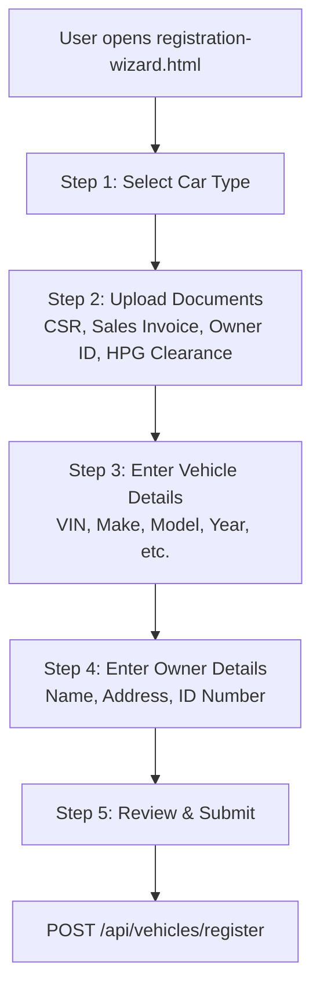
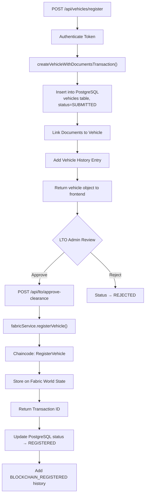
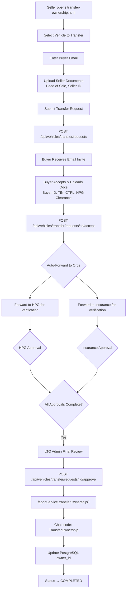

# TrustChain LTO - Vehicle Registration & Transfer Workflow Trace

This document provides a comprehensive trace of the vehicle registration and transfer of ownership workflows, including how Hyperledger Fabric blockchain is integrated throughout the system.

---

## Table of Contents

1. [Architecture Overview](#architecture-overview)
2. [Vehicle Registration Workflow](#vehicle-registration-workflow)
3. [Transfer of Ownership Workflow](#transfer-of-ownership-workflow)
4. [Hyperledger Fabric Integration](#hyperledger-fabric-integration)
5. [What is Stored on Fabric](#what-is-stored-on-fabric)
6. [SSH Commands for Fabric Verification](#ssh-commands-for-fabric-verification)
7. [Transaction Recording Details](#transaction-recording-details)

---

## Architecture Overview

The TrustChain LTO system uses a **dual-database architecture**:

| Component | Technology | Purpose |
|-----------|------------|---------|
| **PostgreSQL** | Database | Primary data store for application state, user data, documents |
| **Hyperledger Fabric** | Blockchain | Immutable ledger for vehicle registration, ownership, and verification status |
| **IPFS** | Storage | Document storage (optional) |

### Key Files

| Layer | File | Purpose |
|-------|------|---------|
| **Chaincode** | `chaincode/vehicle-registration-production/index.js` | Smart contract on Fabric |
| **Fabric Service** | `backend/services/optimizedFabricService.js` | Node.js SDK connection to Fabric |
| **Vehicle Routes** | `backend/routes/vehicles.js` | REST API for registration |
| **Transfer Routes** | `backend/routes/transfer.js` | REST API for transfers |
| **Frontend Wizard** | `registration-wizard.html` + `js/registration-wizard.js` | UI for registration |
| **Transfer UI** | `transfer-ownership.html` | UI for transfer submission |

---

## Vehicle Registration Workflow

### Frontend Flow



### Backend Flow



### Key Backend Code Flow

1. **Route Handler** - `backend/routes/vehicles.js` → `router.post('/register', ...)` handles **POST `/api/vehicles/register`**.
2. **Transaction Helper** - `backend/services/vehicleRegistrationTransaction.js` → `createVehicleWithDocumentsTransaction()` creates vehicle row, links uploaded documents, and writes history (vehicle history action `REGISTERED`).
3. **LTO Approval** - `backend/routes/lto.js` → `router.post('/approve-clearance', ...)` assigns OR/CR numbers, registers on Fabric, updates status to `REGISTERED`, and writes history (`BLOCKCHAIN_REGISTERED`).
4. **Fabric Service** - `backend/services/optimizedFabricService.js` → `registerVehicle(vehicleData)` creates Fabric transaction via `RegisterVehicle`.
5. **Chaincode** - `chaincode/vehicle-registration-production/index.js` → `RegisterVehicle()` stores CR, optionally OR, sets composite keys, emits `VehicleRegistered`.

---

## Registration submission (frontend → backend)

| Step | Location | What happens |
|------|----------|--------------|
| 1.1 | **Frontend** `js/registration-wizard.js` → `submitApplication()` | User clicks Submit. Terms checked, `isSubmitting` set. |
| 1.2 | Same | **Upload documents**: `uploadDocuments(undefined)` → each file in `#document-upload-container` is POSTed to **`/api/documents/upload`**. Response gives `{ id, cid, filename, ... }` per doc type. |
| 1.3 | Same | **Collect data**: `collectApplicationData()` reads form fields → `{ vehicle, owner, ... }` (vehicle: vin, plateNumber, make, model, year, color, vehicleCategory, passengerCapacity, grossVehicleWeight, netWeight, classification, etc.; owner: firstName, lastName, email, phone, address). |
| 1.4 | Same | **POST JSON**: `apiClient.post('/api/vehicles/register', registrationData)` where `registrationData = { vehicle, owner, documents: uploadResults, notes }`. No FormData. |
| 1.5 | **Backend** `server.js` | Route mounted as `app.use('/api/vehicles', require('./backend/routes/vehicles'))` → **POST /api/vehicles/register** handled by `vehicles.js`. |
| 1.6 | **Backend** `backend/routes/vehicles.js` → `router.post('/register', ...)` | Validates `vehicle`, `owner`; normalizes VIN; resolves/creates owner user; validates vehicle category, weights, etc. |
| 1.7 | Same | **Transaction**: `vehicleRegistrationTransaction.createVehicleWithDocumentsTransaction({ vehicle, ownerUser, registrationData, safeMetadata })` → creates vehicle row, history, links documents by ID/CID. |
| 1.8 | Same | If transaction succeeds: fetches full vehicle + verifications + documents; sends **registration confirmation email** to owner (Gmail API); then runs **auto-send clearance**. |

**Key:** There is **no** `/api/registrations` route. The only registration endpoint is **POST /api/vehicles/register** (JSON body).

---

## 2. Auto-sent clearance requests (right after registration)

| Step | Location | What happens |
|------|----------|--------------|
| 2.1 | **Backend** `backend/routes/vehicles.js` (after vehicle creation) | `clearanceService.autoSendClearanceRequests(newVehicle.id, registrationData.documents, requestedBy)` (owner id as requester). |
| 2.2 | **Backend** `backend/services/clearanceService.js` → `autoSendClearanceRequests()` | Waits for documents (with retry). Gets vehicle; determines if new registration vs transfer. |
| 2.3 | Same | **HPG path**: If vehicle has `owner_id` or `hpg_clearance` doc → `sendToHPG(vehicleId, vehicle, allDocuments, requestedBy)`. |
| 2.4 | Same → `sendToHPG()` | Creates HPG clearance request (if none exists); assigns to HPG admin; `updateVerificationStatus(vehicleId, 'hpg', 'PENDING')`; history `HPG_CLEARANCE_REQUESTED`; notification to HPG admin. For **transfers**: OCR extract from OR/CR + owner ID; for **new reg**: uses vehicle metadata. Runs **HPG database check** (`hpgDatabaseService.checkVehicle`); stores result; if FLAGGED, adds note and urgent notification. Returns `{ sent, requestId, automation }`. No **auto-approve** here—HPG still approves manually (or via HPG admin UI). |
| 2.5 | Same | **Insurance path**: If vehicle has `insurance_cert` / `insurance` doc → `sendToInsurance(vehicleId, vehicle, allDocuments, requestedBy)`. |
| 2.6 | Same → `sendToInsurance()` | **Runs auto-verification first**: `autoVerificationService.autoVerifyInsurance(vehicleId, insuranceDoc, vehicle)` → validates certificate, can set status to APPROVED/PENDING/REJECTED and **writes to `vehicle_verifications`**. Then creates insurance clearance request with `autoVerificationResult` in metadata. So **insurance auto-verification is run and stored here** (auto-sent + auto-verify in one go). |
| 2.7 | **Backend** `backend/services/autoVerificationService.js` → `autoVerifyInsurance()` | Validates insurance doc (e.g. CTPL), checks DB/blockchain if used; updates `vehicle_verifications` (insurance) with status and score. |
| 2.8 | **Backend** `clearanceService.js` (after both HPG & Insurance) | If at least one request sent: `updateVehicle(vehicleId, { status: 'SUBMITTED' })`; history `CLEARANCE_REQUESTS_AUTO_SENT` with `autoVerificationResults` (insurance + HPG pre-fill) in metadata. |
| 2.9 | **Backend** `vehicles.js` (response) | Builds `autoVerificationSummary` from `autoSendResults` (insurance status/score, HPG canPreFill/extractedData). Returns `success`, `vehicle`, `documentLinking`, `clearanceRequests: { hpg, insurance }`, `autoVerification`. |

**Summary:**  
- **Insurance**: Clearance request is created and **insurance auto-verification is run and saved** during auto-send; result is in `vehicle_verifications` and in clearance request metadata.  
- **HPG**: Clearance request is created; OCR/DB check run for transfers; HPG admin approves later (or uses HPG verification form with optional **auto-verify** call **POST /api/hpg/verify/auto-verify**).

---

## 3. HPG / Insurance verification (manual or auto on HPG side)

| Step | Location | What happens |
|------|----------|--------------|
| 3.1 | **Frontend** HPG verification form | Officer can run **Auto-Verify**: `apiClient.post('/api/hpg/verify/auto-verify', { requestId, ... })`. |
| 3.2 | **Backend** `backend/routes/hpg.js` | `autoVerificationService.autoVerifyHPG(...)` → hash check, authenticity, score, recommendation, preFilledData. Response includes `autoVerify: { confidenceScore, recommendation, hashCheck, authenticityCheck, preFilledData, ... }`. |
| 3.3 | Same | Officer can then **Approve** or **Reject**: `POST /api/hpg/verify/approve` or `.../reject`. Notifications to LTO admin and owner (Phase 2). |
| 3.4 | **Insurance** | Already auto-verified during auto-send; insurance verifier can approve/reject in their UI (e.g. admin or insurance routes). |

---

## 4. LTO approval (clearance approval → OR/CR, blockchain, email)

| Step | Location | What happens |
|------|----------|--------------|
| 4.1 | **Frontend** `js/admin-dashboard.js` | Admin opens application, clicks Approve. May check inspection for **transfers** (MVIR). Calls **POST `/api/lto/approve-clearance`** with `{ vehicleId, notes }`. |
| 4.2 | **Backend** `backend/routes/lto.js` → `router.post('/approve-clearance', ...)` | Loads vehicle; gets verifications and clearance requests. |
| 4.3 | Same | **Checks**: HPG clearance must exist and be APPROVED/COMPLETED; insurance verification must exist and be APPROVED. If any pending or rejected → 400 with `pendingApprovals` / `rejectedApprovals`. |
| 4.4 | Same | **OR/CR generation**: `db.assignOrAndCrNumbers(vehicleId)` → generates/stores OR and CR numbers, returns `{ orNumber, crNumber, orIssuedAt, crIssuedAt }`. If this fails → 500 (approval cannot proceed). |
| 4.5 | Same | **Transfer only**: If no MVIR, can auto-generate inspection (assignMvirNumber) with PASS/ROADWORTHY. New registration: no MVIR dependency. |
| 4.6 | Same | **Status**: SUBMITTED → PENDING_BLOCKCHAIN (if needed), then **blockchain registration** via `fabricService.registerVehicle(vehicleData)` (vehicleData includes orNumber, crNumber, documents, officerInfo). |
| 4.7 | Same | On success: **Update vehicle**: `status: 'REGISTERED'`, `blockchainTxId`; set registration expiry; history `BLOCKCHAIN_REGISTERED`; **Send approval email to owner** (Gmail API) with **OR number, CR number, blockchain Tx**, and note: *"You can download your OR/CR by logging in to your account."* |
| 4.8 | Same | **Notification**: `db.createNotification(vehicle.owner_id, 'Vehicle Registration Approved', message with OR/CR)`; history `CLEARANCE_APPROVED` with orNumber, crNumber, blockchainTxId. Response: `{ success, vehicleId, orNumber, crNumber, orIssuedAt, crIssuedAt, blockchainTxId, status: 'REGISTERED' }`. |

**Summary:**  
- **OR/CR** are generated and stored in DB and sent **in the approval email as numbers** (and in-app notification).  
- The **OR/CR document** (e.g. PDF) is **not** attached to the email; the email tells the owner to **download OR/CR by logging in** (owner dashboard / certificate or document download flow).

---

## 5. Sending of OR/CR (what “sending” means here)

| Item | Where | How |
|------|--------|-----|
| **OR/CR numbers** | `backend/routes/lto.js` (approve-clearance) | Emailed to owner in approval email (text + HTML) and stored in DB (`vehicles.or_number`, `vehicles.cr_number`). In-app notification includes OR/CR. |
| **OR/CR document (PDF)** | Not sent as email attachment | Owner is directed to log in to the app to download OR/CR (e.g. certificate or document download endpoints used by owner dashboard / certificate generator). |

So “sending of OR/CR” in this system = **email with OR/CR numbers + link/instruction to log in and download** the actual document.

---

## 6. Flow diagram (summary)

```
[Owner] Submit (registration-wizard)
    → uploadDocuments() → POST /api/documents/upload (per doc)
    → collectApplicationData()
    → POST /api/vehicles/register (JSON: vehicle, owner, documents, notes)

[Backend] POST /api/vehicles/register
    → createVehicleWithDocumentsTransaction()
    → Email: "Registration Submitted" to owner
    → clearanceService.autoSendClearanceRequests()
        → sendToHPG()        → HPG clearance request, PENDING; OCR/DB check for transfers
        → sendToInsurance()  → autoVerifyInsurance() → vehicle_verifications; insurance clearance request
    → Response: success, vehicle, documentLinking, clearanceRequests, autoVerification

[HPG/Insurance] Verifiers approve (or HPG uses auto-verify then approve)
    → HPG: POST /api/hpg/verify/auto-verify (optional), then approve/reject
    → Insurance: already auto-verified; verifier approves/rejects

[LTO Admin] Approve
    → POST /api/lto/approve-clearance { vehicleId, notes }
    → Check HPG + Insurance approved
    → assignOrAndCrNumbers(vehicleId)  → OR/CR generated
    → (Transfer only: MVIR if missing)
    → fabricService.registerVehicle()  → blockchain
    → Update vehicle: REGISTERED, blockchainTxId
    → Email to owner: "Vehicle Registration Approved" with OR/CR numbers + "download OR/CR by logging in"
    → Notification to owner with OR/CR
```

---

## 7. Key files reference

| Purpose | File(s) |
|---------|--------|
| Registration submit (frontend) | `js/registration-wizard.js` — `submitApplication()`, `uploadDocuments()`, `collectApplicationData()` |
| Registration API | `backend/routes/vehicles.js` — `router.post('/register', ...)` |
| Vehicle + docs transaction | `backend/services/vehicleRegistrationTransaction.js` — `createVehicleWithDocumentsTransaction()` |
| Auto-send clearance | `backend/services/clearanceService.js` — `autoSendClearanceRequests()`, `sendToHPG()`, `sendToInsurance()` |
| Insurance auto-verification | `backend/services/autoVerificationService.js` — `autoVerifyInsurance()` |
| HPG auto-verify (on demand) | `backend/routes/hpg.js` — POST `/api/hpg/verify/auto-verify`; `autoVerificationService.autoVerifyHPG()` |
| LTO approval (OR/CR, blockchain, email) | `backend/routes/lto.js` — `router.post('/approve-clearance', ...)` |
| OR/CR assignment in DB | `backend/database/services.js` — `assignOrAndCrNumbers(vehicleId)` (uses `generateOrNumber()`, `generateCrNumber()`) |
| Registration & approval emails | `backend/routes/vehicles.js` (registration); `backend/routes/lto.js` (approval); both use `sendMail` from `backend/services/gmailApiService.js` |

This trace covers: **registration submission**, **auto-sent clearance**, **auto-verification (insurance at send, HPG on demand)**, **LTO approval**, and **OR/CR generation and sending (numbers by email + download via login)**.

---

## Transfer of Ownership Workflow

### Frontend Flow



### Backend Transfer Approval Flow

1. **Create Transfer Request** - `backend/routes/transfer.js` → `router.post('/requests', ...)` creates `transfer_requests` row and links seller documents (deed_of_sale, seller_id).
2. **Buyer Accepts** - `backend/routes/transfer.js` → `router.post('/requests/:id/accept', ...)` records buyer acceptance, links buyer documents, and can auto-forward to HPG/Insurance.
3. **Auto-Forward to Organizations** - `backend/routes/transfer.js` → `autoForwardTransferRequest()` sends documents to HPG and Insurance.
4. **Final LTO Approval** - `backend/routes/transfer.js` → `router.post('/requests/:id/approve', ...)` validates approvals, requires MVIR (`vehicles.mvir_number`) before ownership can change, then calls `fabricService.transferOwnership()`.
5. **Fabric Transfer** - `backend/services/optimizedFabricService.js` → `transferOwnership(vin, newOwnerData, transferData)` uses Fabric `TransferOwnership`.
6. **Chaincode TransferOwnership** - `chaincode/vehicle-registration-production/index.js` → `TransferOwnership()` enforces LTOMSP, moves owner to `pastOwners`, writes `OWNERSHIP_TRANSFERRED` history, emits `OwnershipTransferred`.

---

## Hyperledger Fabric Integration

### Network Configuration

| Component | Value |
|-----------|-------|
| **Channel** | `ltochannel` |
| **Chaincode Name** | `vehicle-registration` |
| **Organizations** | LTOMSP, HPGMSP, InsuranceMSP |
| **Ordering Service** | Raft consensus |

### MSP-Based Access Control

The chaincode enforces strict organization-based access control:

| Operation | Allowed MSP(s) |
|-----------|----------------|
| RegisterVehicle | LTOMSP only |
| TransferOwnership | LTOMSP only |
| UpdateVerificationStatus (admin) | LTOMSP only |
| UpdateVerificationStatus (hpg) | HPGMSP only |
| UpdateVerificationStatus (insurance) | InsuranceMSP only |

From `chaincode/vehicle-registration-production/index.js` (UpdateVerificationStatus):

```javascript
if (verifierType === 'insurance' && clientMSPID !== 'InsuranceMSP') {
    throw new Error('Unauthorized: Only InsuranceMSP can set insurance verification');
}
if (verifierType === 'hpg' && clientMSPID !== 'HPGMSP') {
    throw new Error('Unauthorized: Only HPGMSP can set hpg verification');
}
if (verifierType === 'admin' && clientMSPID !== 'LTOMSP') {
    throw new Error('Unauthorized: Only LTOMSP can set admin verification');
}
```

### Identity Mapping

The Fabric service maps application roles to Fabric identities:

| Application Role | Fabric Identity |
|------------------|-----------------|
| lto_admin, lto_officer, admin | admin-lto (or user email if enrolled) |
| hpg_admin, hpg_officer | admin-hpg (or user email if enrolled) |
| insurance_verifier, insurance_admin | admin-insurance (or user email if enrolled) |

---

## What is Stored on Fabric

### Vehicle Record (CR - Certificate of Registration)

Stored with VIN as the key in Fabric world state:

```javascript
{
  docType: 'CR',
  vin: 'ABC123456789',
  crNumber: 'CR-2026-001',
  plateNumber: 'ABC 1234',
  make: 'Toyota',
  model: 'Corolla',
  year: 2024,
  color: 'White',
  engineNumber: 'ENG123456',
  chassisNumber: 'CHS123456',
  vehicleType: 'Car',
  vehicleCategory: 'Sedan',
  passengerCapacity: 5,
  grossVehicleWeight: 1500,
  netWeight: 1200,
  classification: 'Private',
  owner: { email: 'owner@example.com', firstName: 'John', lastName: 'Doe' },
  pastOwners: [
    {
      owner: { email: 'previous@example.com', ... },
      transferDate: '2025-01-15T...',
      transferReason: 'Sale',
      transactionId: 'tx123...'
    }
  ],
  status: 'REGISTERED',
  verificationStatus: { insurance: 'APPROVED', hpg: 'APPROVED', admin: 'APPROVED' },
  history: [
    { action: 'REGISTERED', timestamp: '2024-01-15T...', performedBy: 'LTOMSP', officerInfo: { userId, email, name, mspId }, transactionId: 'tx123...' },
    { action: 'VERIFICATION_APPROVED', timestamp: '2024-01-16T...', performedBy: 'InsuranceMSP', verifierType: 'insurance', transactionId: 'tx456...' },
    { action: 'OWNERSHIP_TRANSFERRED', timestamp: '2025-01-15T...', performedBy: 'LTOMSP', previousOwner: { email, firstName, lastName }, newOwner: { email, firstName, lastName }, transactionId: 'tx789...' }
  ],
  blockchainTxId: 'abc123def456...',
  registrationDate: '2024-01-15T...',
  lastUpdated: '2025-01-15T...'
}
```

### OR (Official Receipt) Record

Stored with OR number as key:

```javascript
{
  docType: 'OR',
  orNumber: 'OR-2026-001',
  relatedCR: 'ABC123456789', // VIN
  crNumber: 'CR-2026-001',
  amountPaid: 5000,
  paymentDate: '2024-01-15T...',
  expiryDate: '2025-01-15T...',
  status: 'ACTIVE',
  registrationType: 'PRIVATE',
  blockchainTxId: 'abc123...'
}
```

### Composite Keys

The chaincode creates composite keys for efficient lookups:

| Composite Key Type | Format | Example |
|-------------------|--------|---------|
| Owner lookup | `owner~vin` | `owner~vin:john@example.com:ABC123` |
| Plate lookup | `plate~vin` | `plate~vin:ABC1234:ABC123` |
| CR number lookup | `cr~vin` | `cr~vin:CR-2026-001:ABC123` |
| OR to CR link | `or~cr` | `or~cr:OR-2026-001:ABC123` |

---

## SSH Commands for Fabric Verification

### Your Container Configuration

| Container | Name | Port |
|-----------|------|------|
| LTO Peer | `peer0.lto.gov.ph` | 7051 |
| HPG Peer | `peer0.hpg.gov.ph` | 8051 |
| Insurance Peer | `peer0.insurance.gov.ph` | 9051 |
| Orderer | `orderer.lto.gov.ph` | 7050 |
| CLI | `cli` | - |
| Chaincode | `chaincode-vehicle-reg` | 9999 |
| CouchDB | `couchdb` | 5984 |

### Check Fabric Network Status

```bash
# List running containers
docker ps | grep -E "(peer|orderer|chaincode|cli)"

# Check LTO peer logs
docker logs peer0.lto.gov.ph --tail 100

# Check chaincode container logs
docker logs chaincode-vehicle-reg --tail 100

# Check for chaincode errors
docker logs chaincode-vehicle-reg 2>&1 | grep -i error
```

### Query Fabric Ledger via CLI

```bash
# Enter CLI container
docker exec -it cli bash

# Inside CLI - Query a vehicle by VIN
peer chaincode query -C ltochannel -n vehicle-registration -c '{"function":"GetVehicle","Args":["YOUR_VIN_HERE"]}'

# Get vehicle history
peer chaincode query -C ltochannel -n vehicle-registration -c '{"function":"GetVehicleHistory","Args":["YOUR_VIN_HERE"]}'

# Get ownership history (current owner + past owners + transfer history)
peer chaincode query -C ltochannel -n vehicle-registration -c '{"function":"GetOwnershipHistory","Args":["YOUR_VIN_HERE"]}'

# Query all vehicles
peer chaincode query -C ltochannel -n vehicle-registration -c '{"function":"GetAllVehicles","Args":[]}'

# Query vehicles by status (REGISTERED, PRE_MINTED, etc.)
peer chaincode query -C ltochannel -n vehicle-registration -c '{"function":"QueryVehiclesByStatus","Args":["REGISTERED"]}'

# Get system stats
peer chaincode query -C ltochannel -n vehicle-registration -c '{"function":"GetSystemStats","Args":[]}'

# Exit CLI
exit
```

### One-Liner Commands (Without Entering CLI)

```bash
# Query vehicle by VIN (replace YOUR_VIN_HERE)
docker exec cli peer chaincode query -C ltochannel -n vehicle-registration -c '{"function":"GetVehicle","Args":["YOUR_VIN_HERE"]}'

# Get all vehicles
docker exec cli peer chaincode query -C ltochannel -n vehicle-registration -c '{"function":"GetAllVehicles","Args":[]}'

# Get ownership history
docker exec cli peer chaincode query -C ltochannel -n vehicle-registration -c '{"function":"GetOwnershipHistory","Args":["YOUR_VIN_HERE"]}'

# Pretty print with jq
docker exec cli peer chaincode query -C ltochannel -n vehicle-registration -c '{"function":"GetVehicle","Args":["YOUR_VIN_HERE"]}' | jq .
```

### Get Block/Chain Information

```bash
# Get chain info (height, current block hash)
docker exec cli peer channel getinfo -c ltochannel

# Fetch a specific block (e.g., block 10)
docker exec cli peer channel fetch 10 /tmp/block_10.pb -c ltochannel

# Copy block out of container and decode
docker cp cli:/tmp/block_10.pb ./block_10.pb
docker exec cli configtxlator proto_decode --input /tmp/block_10.pb --type common.Block
```

### Verify Transaction by ID

```bash
# Get transaction by ID
docker exec cli peer chaincode query -C ltochannel -n qscc -c '{"function":"GetTransactionByID","Args":["ltochannel","YOUR_TX_ID_HERE"]}'

# Get block by transaction ID
docker exec cli peer chaincode query -C ltochannel -n qscc -c '{"function":"GetBlockByTxID","Args":["ltochannel","YOUR_TX_ID_HERE"]}'
```

### CouchDB Direct Queries (World State)

```bash
# Access CouchDB Fauxton UI in browser
# http://YOUR_SERVER_IP:5984/_utils

# List all databases (each channel has a database)
curl -s http://localhost:5984/_all_dbs | jq .

# Query the ltochannel database (world state)
# Database name format: ltochannel_vehicle-registration
curl -s http://localhost:5984/ltochannel_vehicle-registration/_all_docs | jq .

# Get a specific vehicle by VIN (VIN is the document ID)
curl -s http://localhost:5984/ltochannel_vehicle-registration/YOUR_VIN_HERE | jq .

# Find all vehicles with docType = CR
curl -s -X POST http://localhost:5984/ltochannel_vehicle-registration/_find \
  -H "Content-Type: application/json" \
  -d '{"selector":{"docType":"CR"}}' | jq .

# Find all REGISTERED vehicles
curl -s -X POST http://localhost:5984/ltochannel_vehicle-registration/_find \
  -H "Content-Type: application/json" \
  -d '{"selector":{"docType":"CR","status":"REGISTERED"}}' | jq .

# Find vehicles by owner email
curl -s -X POST http://localhost:5984/ltochannel_vehicle-registration/_find \
  -H "Content-Type: application/json" \
  -d '{"selector":{"owner.email":"owner@example.com"}}' | jq .

# Count total documents in world state
curl -s http://localhost:5984/ltochannel_vehicle-registration | jq .doc_count
```

### Verify Specific Transactions

```bash
# Step 1: Get a VIN from your PostgreSQL database
docker exec postgres psql -U lto_user -d lto_db -c "SELECT vin, blockchain_tx_id, status FROM vehicles WHERE blockchain_tx_id IS NOT NULL LIMIT 5;"

# Step 2: Verify vehicle exists on Fabric
docker exec cli peer chaincode query -C ltochannel -n vehicle-registration -c '{"function":"GetVehicle","Args":["VIN_FROM_STEP_1"]}'

# Step 3: Compare blockchain data with PostgreSQL data
# The blockchainTxId in Fabric response should match blockchain_tx_id in PostgreSQL
```

---

## Transaction Recording Details

### Registration Transaction Recording

When LTO admin approves a vehicle registration:

1. **Backend calls Fabric** - `fabricService.registerVehicle(vehicleData)`
2. **Chaincode executes** - `RegisterVehicle()` function
3. **World state updated** - Vehicle CR stored with VIN as key
4. **Event emitted** - `VehicleRegistered` event
5. **Transaction committed** - Returns transaction ID
6. **PostgreSQL updated** - `vehicles.blockchain_tx_id` saved
7. **History added** - `BLOCKCHAIN_REGISTERED` in `vehicle_history`

### Rejection Transaction Recording

Rejections are **NOT recorded on blockchain**. They are only stored in PostgreSQL:

| Field | Value |
|-------|-------|
| `vehicles.status` | `REJECTED` |
| `vehicle_history.action` | `CLEARANCE_REJECTED` or `VERIFICATION_REJECTED` |
| `vehicle_history.metadata` | Rejection reason, verifier info |

> **Note:** Rejections are intentionally not on blockchain because they do not represent authoritative vehicle registration, and resubmissions should not pollute the immutable ledger.

### Transfer Transaction Recording

When LTO admin approves a transfer:

1. **Validate prerequisites** - HPG and Insurance approvals, MVIR exists
2. **Backend calls Fabric** - `fabricService.transferOwnership(vin, newOwner, transferData)`
3. **Chaincode executes** - `TransferOwnership()`:
   - Previous owner moved to `pastOwners`
   - New owner set in `owner`
   - History entry with `OWNERSHIP_TRANSFERRED`
   - Owner composite keys updated
4. **Event emitted** - `OwnershipTransferred` event
5. **Transaction committed** - Returns transaction ID
6. **PostgreSQL updated**:
   - `vehicles.owner_id` = buyer ID
   - `vehicles.origin_type` = `TRANSFER`
   - `vehicles.blockchain_tx_id` = new transaction ID
   - `transfer_requests.status` = `COMPLETED`
7. **History added** - `BLOCKCHAIN_TRANSFERRED` and `TRANSFER_COMPLETED` actions

### Verification Status Recording

When HPG/Insurance/Admin updates verification:

1. **Backend calls Fabric** - `fabricService.updateVerificationStatus(vin, type, status, notes)`
2. **Chaincode validates MSP** - Only correct MSP can set its verification type
3. **World state updated** - `vehicle.verificationStatus[type]` updated
4. **History entry added** - to vehicle `history` on blockchain
5. **Events emitted** - `VerificationUpdated`, plus `ClearanceApproved` / `ClearanceRejected`

---

## Summary

| Workflow | PostgreSQL | Fabric Blockchain |
|----------|------------|-------------------|
| **Registration Submit** | ✅ Vehicle created, status=SUBMITTED | ❌ Not yet |
| **LTO Approval** | ✅ Status → REGISTERED | ✅ `RegisterVehicle()` called |
| **Rejection** | ✅ Status → REJECTED | ❌ Not recorded |
| **Transfer Request** | ✅ `transfer_requests` created | ❌ Not yet |
| **Transfer Approval** | ✅ owner_id updated | ✅ `TransferOwnership()` called |
| **Verification Update** | ✅ `vehicle_verifications` | ✅ `UpdateVerificationStatus()` called |

> **Important:** Blockchain is the source of truth for registered vehicle identity, ownership history, verification approvals, and audit history. PostgreSQL tracks application state, user data, and document references (including pending or rejected applications).
